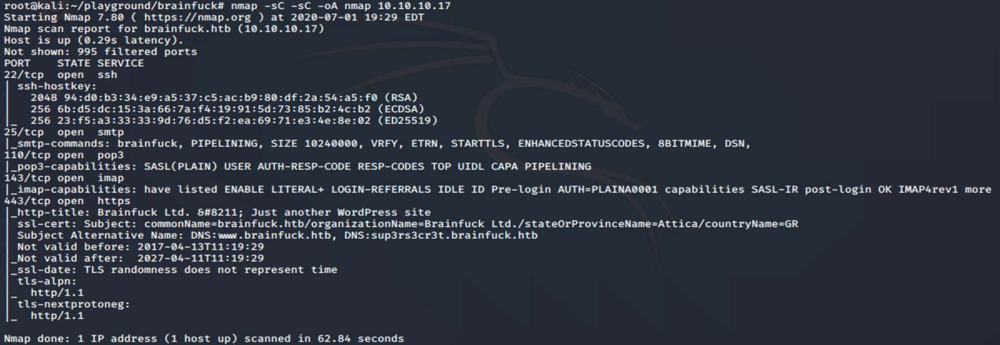
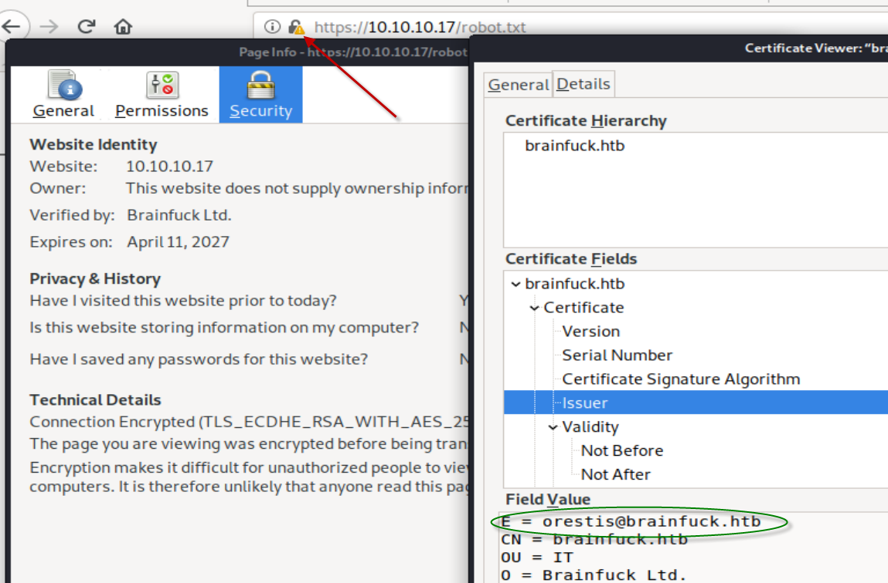
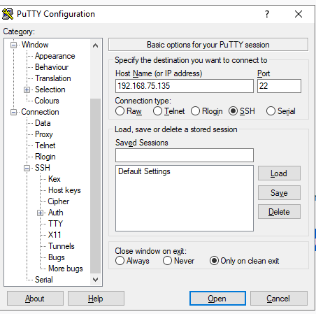
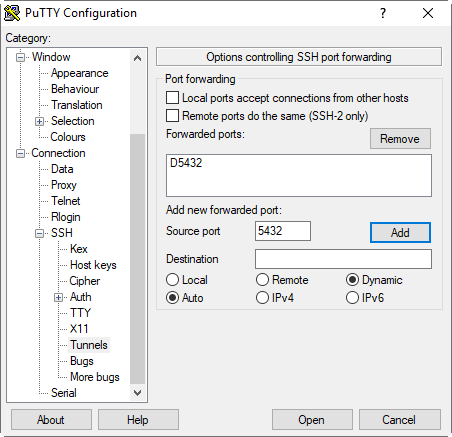
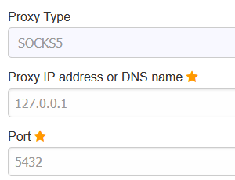

# 10.10.10.17

<details>
    <summary>1. Starting Nmap </summary>
    
```bash
root@kali:~/playground/brainfuck# nmap -sC -sC -oA nmap 10.10.10.17


    <summary>Starting Nmap 7.80 ( https://nmap.org ) at 2020-07-01 19:29 EDT </summary>
Nmap scan report for brainfuck.htb (10.10.10.17)
Host is up (0.29s latency).
Not shown: 995 filtered ports
PORT    STATE SERVICE
22/tcp  open  ssh
| ssh-hostkey: 
|   2048 94:d0:b3:34:e9:a5:37:c5:ac:b9:80:df:2a:54:a5:f0 (RSA)
|   256 6b:d5:dc:15:3a:66:7a:f4:19:91:5d:73:85:b2:4c:b2 (ECDSA)
|_  256 23:f5:a3:33:33:9d:76:d5:f2:ea:69:71:e3:4e:8e:02 (ED25519)
25/tcp  open  smtp
|_smtp-commands: brainfuck, PIPELINING, SIZE 10240000, VRFY, ETRN, STARTTLS, ENHANCEDSTATUSCODES, 8BITMIME, DSN, 
110/tcp open  pop3
|_pop3-capabilities: SASL(PLAIN) USER AUTH-RESP-CODE RESP-CODES TOP UIDL CAPA PIPELINING
143/tcp open  imap
|_imap-capabilities: have listed ENABLE LITERAL+ LOGIN-REFERRALS IDLE ID Pre-login AUTH=PLAINA0001 capabilities SASL-IR post-login OK IMAP4rev1 more
443/tcp open  https
|_http-title: Brainfuck Ltd. &#8211; Just another WordPress site
| ssl-cert: Subject: commonName=brainfuck.htb/organizationName=Brainfuck Ltd./stateOrProvinceName=Attica/countryName=GR
| Subject Alternative Name: DNS:www.brainfuck.htb, DNS:sup3rs3cr3t.brainfuck.htb
| Not valid before: 2017-04-13T11:19:29
|_Not valid after:  2027-04-11T11:19:29
|_ssl-date: TLS randomness does not represent time
| tls-alpn: 
|_  http/1.1
| tls-nextprotoneg: 
|_  http/1.1

Nmap done: 1 IP address (1 host up) scanned in 62.84 seconds

```

</details>
  

> We see 443 is open (Access to website over https) plus there is email server related ports open

>  We Interogate the certificate
<details>
    <summary>See certificate</summary>
    


</details>

> Email: `oretis@brainfuck.htb`

> From nmap as well as from certificates we know `CN(common names)` and `SAN (Subject alternative name)`. Added that to host file.

2. Check website on port SSL (https://) but before that update `hosts` file

```
echo "10.10.10.17 www.brainfuck.htb sup3rs3cr3t.brainfuck.htb brainfuck.htb" >> /etc/hosts
```

3. Conduct Worpress Scan

```bash
wpscan --url https://brainfuck.htb --disable-tls-checks
wpscan --url https://brainfuck.htb --disable-tls-checks -e u    #enumerate users
```
<details>
    <summary>wpscan result</summary>
```bash
[+] URL: https://brainfuck.htb/ [10.10.10.17]
[+] Started: Thu Jul  2 01:34:14 2020

Interesting Finding(s):

[+] Headers
 | Interesting Entry: Server: nginx/1.10.0 (Ubuntu)
 | Found By: Headers (Passive Detection)
 | Confidence: 100%

[+] XML-RPC seems to be enabled: https://brainfuck.htb/xmlrpc.php
 | Found By: Direct Access (Aggressive Detection)
 | Confidence: 100%
 | References:
 |  - http://codex.wordpress.org/XML-RPC_Pingback_API
 |  - https://www.rapid7.com/db/modules/auxiliary/scanner/http/wordpress_ghost_scanner
 |  - https://www.rapid7.com/db/modules/auxiliary/dos/http/wordpress_xmlrpc_dos
 |  - https://www.rapid7.com/db/modules/auxiliary/scanner/http/wordpress_xmlrpc_login
 |  - https://www.rapid7.com/db/modules/auxiliary/scanner/http/wordpress_pingback_access

[+] https://brainfuck.htb/readme.html
 | Found By: Direct Access (Aggressive Detection)
 | Confidence: 100%

[+] The external WP-Cron seems to be enabled: https://brainfuck.htb/wp-cron.php
 | Found By: Direct Access (Aggressive Detection)
 | Confidence: 60%
 | References:
 |  - https://www.iplocation.net/defend-wordpress-from-ddos
 |  - https://github.com/wpscanteam/wpscan/issues/1299

[+] WordPress version 4.7.3 identified (Insecure, released on 2017-03-06).
 | Found By: Rss Generator (Passive Detection)
 |  - https://brainfuck.htb/?feed=rss2, <generator>https://wordpress.org/?v=4.7.3</generator>
 |  - https://brainfuck.htb/?feed=comments-rss2, <generator>https://wordpress.org/?v=4.7.3</generator>

[+] WordPress theme in use: proficient
 | Location: https://brainfuck.htb/wp-content/themes/proficient/
 | Last Updated: 2020-06-22T00:00:00.000Z
 | Readme: https://brainfuck.htb/wp-content/themes/proficient/readme.txt
 | [!] The version is out of date, the latest version is 3.0.24
 | Style URL: https://brainfuck.htb/wp-content/themes/proficient/style.css?ver=4.7.3
 | Style Name: Proficient
 | Description: Proficient is a Multipurpose WordPress theme with lots of powerful features, instantly giving a prof...
 | Author: Specia
 | Author URI: https://speciatheme.com/
 |
 | Found By: Css Style In Homepage (Passive Detection)
 |
 | Version: 1.0.6 (80% confidence)
 | Found By: Style (Passive Detection)
 |  - https://brainfuck.htb/wp-content/themes/proficient/style.css?ver=4.7.3, Match: 'Version: 1.0.6'

[+] Enumerating All Plugins (via Passive Methods)
[+] Checking Plugin Versions (via Passive and Aggressive Methods)

[i] Plugin(s) Identified:

[+] wp-support-plus-responsive-ticket-system
 | Location: https://brainfuck.htb/wp-content/plugins/wp-support-plus-responsive-ticket-system/
 | Last Updated: 2019-09-03T07:57:00.000Z
 | [!] The version is out of date, the latest version is 9.1.2
 |
 | Found By: Urls In Homepage (Passive Detection)
 |
 | Version: 7.1.3 (100% confidence)
 | Found By: Readme - Stable Tag (Aggressive Detection)
 |  - https://brainfuck.htb/wp-content/plugins/wp-support-plus-responsive-ticket-system/readme.txt
 | Confirmed By: Readme - ChangeLog Section (Aggressive Detection)
 |  - https://brainfuck.htb/wp-content/plugins/wp-support-plus-responsive-ticket-system/readme.txt

[+] Enumerating Config Backups (via Passive and Aggressive Methods)
 Checking Config Backups - Time: 00:00:02 <==============================================================================> (21 / 21) 100.00% Time: 00:00:02

[i] No Config Backups Found.

[!] No WPVulnDB API Token given, as a result vulnerability data has not been output.
[!] You can get a free API token with 50 daily requests by registering at https://wpvulndb.com/users/sign_up

[+] Finished: Thu Jul  2 01:34:28 2020
[+] Requests Done: 53
[+] Cached Requests: 5
[+] Data Sent: 11.692 KB
[+] Data Received: 161.223 KB
[+] Memory used: 208.148 MB
[+] Elapsed time: 00:00:14
root@kali:~/playground/brainfuck#


[i] User(s) Identified:

[+] admin
 | Found By: Author Posts - Display Name (Passive Detection)
 | Confirmed By:
 |  Rss Generator (Passive Detection)
 |  Author Id Brute Forcing - Author Pattern (Aggressive Detection)
 |  Login Error Messages (Aggressive Detection)

[+] administrator
 | Found By: Author Id Brute Forcing - Author Pattern (Aggressive Detection)
 | Confirmed By: Login Error Messages (Aggressive Detection)

</details>

> plugin: wp-support-plus-responsive-ticket-system 7.1.3
> admin and administrator users exist

4. Search for the exploit to worpress 
<details>
    <summary>`searchsploit wordpress responsive`</summary>

```
WordPress Plugin WP Support Plus Responsive Ticket System 2.0 - Multiple Vulnerabilities                                                                                                                 | php/webapps/34589.txt
WordPress Plugin WP Support Plus Responsive Ticket System 7.1.3 - Privilege Escalation                                                                                                                   | php/webapps/41006.txt
WordPress Plugin WP Support Plus Responsive Ticket System 7.1.3 - SQL Injection                                                                                                                          | php/webapps/40939.txt
WordPress Theme Think Responsive 1.0 - Arbitrary File Upload                                                                                                                                             | php/webapps/29332.txt

```
</details>

___________________________________________
<details>
	<summary> Failed attempts</summary>

> Want to access the website https://brainfuck.htb from the windows host machine instead of the VM running Kali (which got VPN connection to htb)

- Set up SSH tunnel ? Failed :(
    + Add the CN(common name) and SAN(subject alternative name) from nmap result in `/etc/hosts` file
     `10.10.10.17 www.brainfuck.htb sup3rs3cr3t.brainfuck.htb brainfuck.htb`
    + Port forward to local machine: `ssh -L 443:10.10.10.17:443  kali@10.10.14.18`
    + On windows host machine edit the hosts file `c:\Windows\System32\Drivers\etc\hosts`
    `10.10.10.17 www.brainfuck.htb sup3rs3cr3t.brainfuck.htb brainfuck.htb`
    + Access in windows host machine URL: https://www.brainfuck.htb https://sup3rs3cr3t.brainfuck.htb https://brainfuck.htb
    
- Set up `Reverse SSH` tunnel. Worked :)
    + MY PC(WINDOWS HOST) ---> (KALI VM) NIC1(NAT,eth0):192.168.75.135 VPN(tun0):10.10.14.18  (and a route to 10.10.10.1 via 10.10.14.1) 
    + Can access https://10.10.10.17 on KALI VM but **Want to access https://10.10.10.17 on MY PC(WINDOWS HOST)**
    + Create a SSH tunnel with  Forwarding port: source port `5432` and a `Dynamic` destination port <using putty>
    + Set up SOCK5 proxy 127.0.0.1:5432 and also turn on DNS uing SOCK5 proxy <using foxy proxy plugin for firefox>
    + Now can access the website accessible form other PC
    





> Now can access `https://10.10.10.17` or `https://www.brainfuck.htb` on Host machine

</details>

